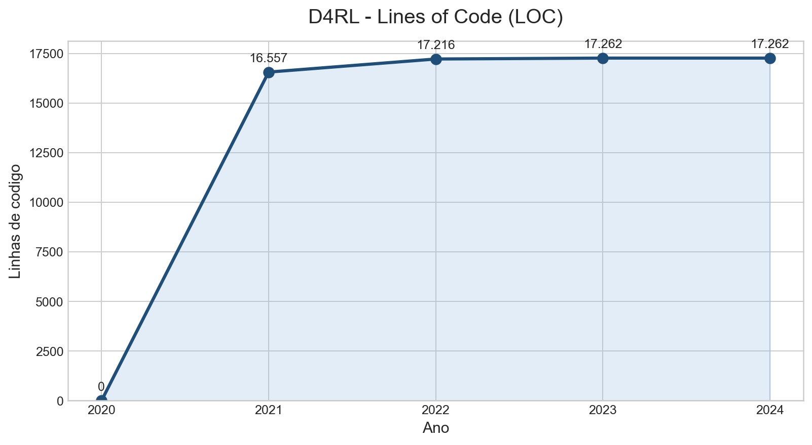

# Explorando evolução de código

Neste exercício, iremos explorar a evolução de código em sistemas reais.

Iremos utilizar a ferramenta [GitEvo](https://github.com/andrehora/gitevo).
Essa ferramenta analisa a evolução de código em repositórios Git nas linguagens Python, JavaScript, TypeScript e Java, e gera relatórios `HTML` como [este](https://andrehora.github.io/gitevo-examples/python/pandas.html).

Mais exemplos de relatórios podem ser podem ser encontrados em https://github.com/andrehora/gitevo-examples.

# Passo 1: Selecionar repositório a ser analisado

Selecione um repositório relevante na linguagem de sua preferência (Python, JavaScript, TypeScript ou Java).
Você pode encontrar projetos interessantes nos links abaixo:

- Python: https://github.com/topics/python?l=python
- JavaScript: https://github.com/topics/javascript?l=javascript
- TypeScript: https://github.com/topics/typescript?l=typescript
- Java: https://github.com/topics/java?l=java

# Passo 2: Instalar e rodar a ferramenta GitEvo

> [!NOTE]
> Antes de instalar a ferramenta, é recomendado criar e ativar um [ambiente virtual Python](https://packaging.python.org/en/latest/guides/installing-using-pip-and-virtual-environments/#create-and-use-virtual-environments).

Instale a ferramenta [GitEvo](https://github.com/andrehora/gitevo) com o comando:

```
$ pip install gitevo
```

Execute a ferramenta no repositório selecionado utilizando o comando abaixo (ajuste conforme a linguagem do repositório).
Substitua `<git_url>` pela URL do repositório que será analisado:

```shell
# Python
$ gitevo -r python <git_url>

# JavaScript
$ gitevo -r javascript <git_url>

# TypeScript
$ gitevo -r typescript <git_url>

# Java
$ gitevo -r java <git_url>
```

Por exemplo, para analisar o projeto Flask escrito em Python:

```
$ gitevo -r python https://github.com/pallets/flask
```

> [!NOTE]
> Essa etapa pode demorar alguns minutos pois o projeto será clonado e analisado localmente.

# Passo 3: Explorar o relatório de evolução de código

Após executar a ferramenta [GitEvo](https://github.com/andrehora/gitevo), é gerado um relatório `HTML` contendo diversos gráficos sobre a evolução do código.

Abra o relatório `HTML` e observe com atenção os gráficos.

# Passo 4: Explicar um gráfico de evolução de código

Selecione um dos gráficos de evolução e explique-o com suas palavras.
Por exemplo, você pode:

- Detalhar a evolução ao longo do tempo
- Detalhar se as curvas estão de acordo com boas práticas
- Explicar grandes alterações nas curvas
- Explorar a documentação do repositório em busca de explicações para grandes alterações
- etc.

Seja criativo!

# Instruções para o exercício

1. Crie um `fork` deste repositório (mais informações sobre forks [aqui](https://docs.github.com/pt/pull-requests/collaborating-with-pull-requests/working-with-forks/fork-a-repo)).
2. Adicione o relatório `HTML` no seu fork.
3. No Moodle, submeta apenas a URL do seu `fork`.

Responda às questões abaixo diretamente neste arquivo `README.md` do seu fork:

1. Repositório selecionado: https://github.com/Farama-Foundation/D4RL
2. Gráfico selecionado:

   
3. Explicação: O gráfico de `Lines of code (LOC)` mostra três fases bem claras na evolução do D4RL. O ponto de 2020 aparece zerado porque o snapshot usado pelo GitEvo para esse ano cai no commit inicial do repositório (`e0ee964`), quando ainda não havia arquivos Python no projeto. A partir daí, o salto até 2021 é muito grande: o relatório passa para 16.557 linhas de código e 109 arquivos Python. Isso faz sentido quando olhamos o histórico de 2020, que concentra a construção do benchmark e a entrada de vários módulos e ambientes, como Flow, Kitchen, AntMaze, CARLA, Minigrid e métricas de off-policy evaluation.

   Em 2022 o crescimento é pequeno, chegando a 17.216 LOC e 112 arquivos Python. Essa mudança discreta sugere uma fase de consolidação: o núcleo do projeto já estava montado e os commits passam a ser mais focados em correções, compatibilidade e ajustes pontuais. Em 2023 e 2024 a curva praticamente estaciona em 17.262 LOC, o que indica manutenção mínima.

   Na minha leitura, essa curva está alinhada com uma trajetória saudável de um projeto que primeiro cresce rápido para estabelecer seu escopo e depois estabiliza quando amadurece. Ao mesmo tempo, a estabilização final também mostra que o D4RL deixou de evoluir ativamente. Isso combina com a documentação atual do repositório, que informa a descontinuação da biblioteca e a migração do desenvolvimento para projetos da Farama Foundation, como Gymnasium, Gymnasium-Robotics e Minari.

Relatório HTML gerado: [report_D4RL.html](./report_D4RL.html)


